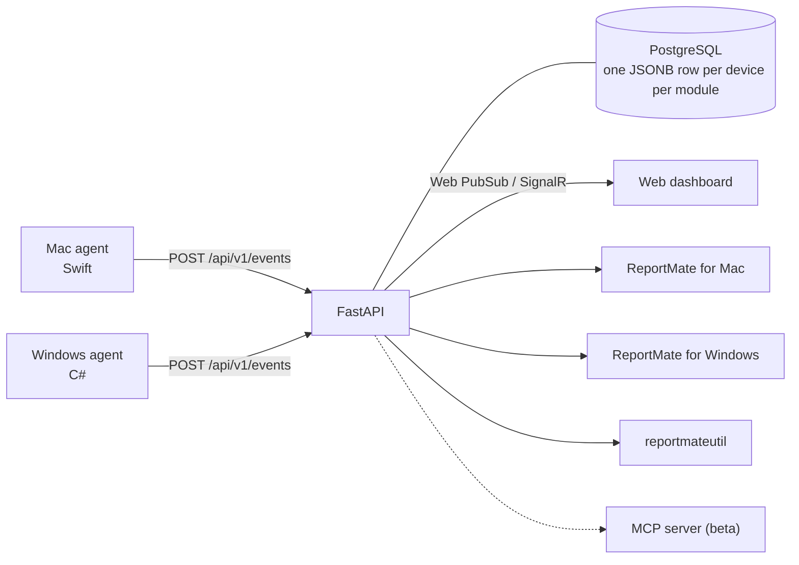

<div align="left">

# ReportMate

## Your whole fleet. Always reporting in.

Monitor, manage, and report on your **Mac and Windows** fleet from a single dashboard.
Real-time hardware, software, security, and network data — collected at the endpoint, streamed to a live dashboard, an API, native apps, and a command-line tool.

**Self-host it for free, or let us run it for you.**

[**Website**](https://reportmate.app) · [**Live Demo**](https://demo.reportmate.app) · [**API Docs**](https://reportmate.app/docs) · [**OpenAPI spec**](https://reportmate.app/openapi.json)

</div>

<div align="center">


<table>
  <tr>
    <td></td>
    <td></td>
    <td></td>
  </tr>
  <tr>
    <td align="center">Every device</td>
    <td align="center">One device, every module</td>
    <td align="center">Installs across the fleet</td>
  </tr>
</table>

</div>

## What it does

Lightweight native agents collect data on-device with **osquery**, **bash**, and **pwsh** — with deep support for the **Munki** and **Cimian** software deployment tools — and POST a unified JSON payload to the API. Everything downstream is a reader: heavy lifting happens at the endpoint, not in the cloud.

- **Cross-platform** — native agents for macOS (Swift) and Windows (C#/.NET)
- **Eleven modules** — hardware, network, security, applications, installs, inventory, system, management, peripherals, identity, profiles
- **Real-time dashboard** — Next.js frontend with live fleet overview, device drill-down, and posture views
- **Native apps** — the same fleet views as a SwiftUI app on the Mac and a WPF app on Windows, each also able to read the local agent's cache with no API
- **REST API** — FastAPI backend with a published OpenAPI spec, versioned endpoints, rate limiting, and pagination
- **Command line** — `reportmateutil`, one binary with a command for every API route, printing the API's JSON unchanged
- **Multi-cloud** — Terraform modules for Azure and AWS, or self-host on any infrastructure
- **Scriptable** — `reportmateutil` gives scripts and coding agents the whole API from the terminal

## Architecture

**Collection → Transmission → Ingestion → Storage → Display**



## The command line: `reportmateutil`

One binary with a command for every API route, printing the API's JSON unchanged. It ships inside both native apps and as standalone tarballs on [its releases](https://github.com/reportmate/reportmate-cli/releases).

```
reportmateutil devices --limit 20
reportmateutil device SERIAL --module installs
reportmateutil events failures --hours 24
```

Setup, credentials and every command: [reportmate-cli](https://github.com/reportmate/reportmate-cli).

## Quick start

Run the whole stack on one machine with Docker Compose. Clone the self-hosted repository and copy the environment template:

```
git clone https://github.com/reportmate/selfhosted-docker-reportmate
cd selfhosted-docker-reportmate
cp .env.example .env
```

Set `DB_PASSWORD`, `API_INTERNAL_SECRET`, `REPORTMATE_PASSPHRASE` and `NEXTAUTH_SECRET` in `.env`, then start it:

```
docker compose up -d
```

The dashboard is at http://localhost:3000 in demo mode and the API at http://localhost:8000. Point an agent at the API with the passphrase you set. For production, deploy with the [Azure](https://github.com/reportmate/terraform-azurerm-reportmate) or [AWS](https://github.com/reportmate/terraform-aws-reportmate) Terraform module, or bake the [appliance image](https://github.com/reportmate/selfhosted-docker-reportmate#appliance-image-packer).

## Repositories

| | Repo | Stack | License | |
|---|---|---|---|---|
| Server | [reportmate-api](https://github.com/reportmate/reportmate-api) | Python · FastAPI | AGPL-3.0 | Ingestion and query REST API; exports the OpenAPI spec on every build |
| Server | [reportmate-app-web](https://github.com/reportmate/reportmate-app-web) | TypeScript · Next.js | AGPL-3.0 | Real-time web dashboard |
| Agent | [reportmate-client-mac](https://github.com/reportmate/reportmate-client-mac) | Swift | MIT | macOS telemetry agent |
| Agent | [reportmate-client-win](https://github.com/reportmate/reportmate-client-win) | C# · .NET | MIT | Windows telemetry agent |
| App | [reportmate-app-swift](https://github.com/reportmate/reportmate-app-swift) | Swift · SwiftUI | LICENSE_TBD | ReportMate for Mac, bundling `reportmateutil` |
| App | [reportmate-app-csharp](https://github.com/reportmate/reportmate-app-csharp) | C# · WPF | LICENSE_TBD | ReportMate for Windows, bundling `reportmateutil` |
| Tooling | [reportmate-cli](https://github.com/reportmate/reportmate-cli) | Rust | AGPL-3.0 | `reportmateutil`, the fleet from the terminal |
| Tooling | [reportmate-mcp](https://github.com/reportmate/reportmate-mcp) | Python · FastMCP | AGPL-3.0 | Your fleet for AI agents (beta) |
| Deploy | [terraform-azurerm-reportmate](https://github.com/reportmate/terraform-azurerm-reportmate) | HCL | MIT | Azure infrastructure module |
| Deploy | [terraform-aws-reportmate](https://github.com/reportmate/terraform-aws-reportmate) | HCL | MIT | AWS infrastructure module |
| Deploy | [selfhosted-docker-reportmate](https://github.com/reportmate/selfhosted-docker-reportmate) | Docker · Packer | MIT | Compose stack and appliance image |
| Project | [reportmate-website](https://github.com/reportmate/reportmate-website) | Astro | MIT | [reportmate.app](https://reportmate.app) and the API docs, regenerated from the API source daily |

## Releases and signing

Public repositories build **unsigned** artifacts on every push and publish them as GitHub release assets on a version tag: the agents' packages, the apps' bundles and installers, and the CLI's tarballs. Signing, notarization and deployment to endpoints happen downstream, in whatever management pipeline runs a fleet, against a pinned release. No signing identity or fleet configuration lives in these repositories.

## Part of a bigger toolkit

ReportMate reports on a fleet that something else provisions and manages. [BootstrapMate](https://github.com/bootstrapmate) provisions new Macs and PCs and can post each run's summary to ReportMate, and the agents read deep detail from [Munki](https://github.com/munki/munki) and [Cimian](https://github.com/windowsadmins/cimian), the tools that keep software current afterwards.

## Open core

ReportMate is open source. The **server** (API and web dashboard) and the **CLI** are **AGPL-3.0**; the **endpoint agents**, **Terraform modules**, and **deployment tooling** are **MIT**. A separate commercial license is available for organizations whose policies do not permit AGPL.

Self-host the whole stack for free, or pick a [managed plan](https://reportmate.app/pricing) and we'll run it for you.

## Contributing

See [CONTRIBUTING.md](https://github.com/reportmate/.github/blob/main/CONTRIBUTING.md). Contributions are accepted under the project [CLA](https://github.com/reportmate/.github/blob/main/CLA.md) with a [DCO](https://developercertificate.org/) sign-off (`git commit -s`).
